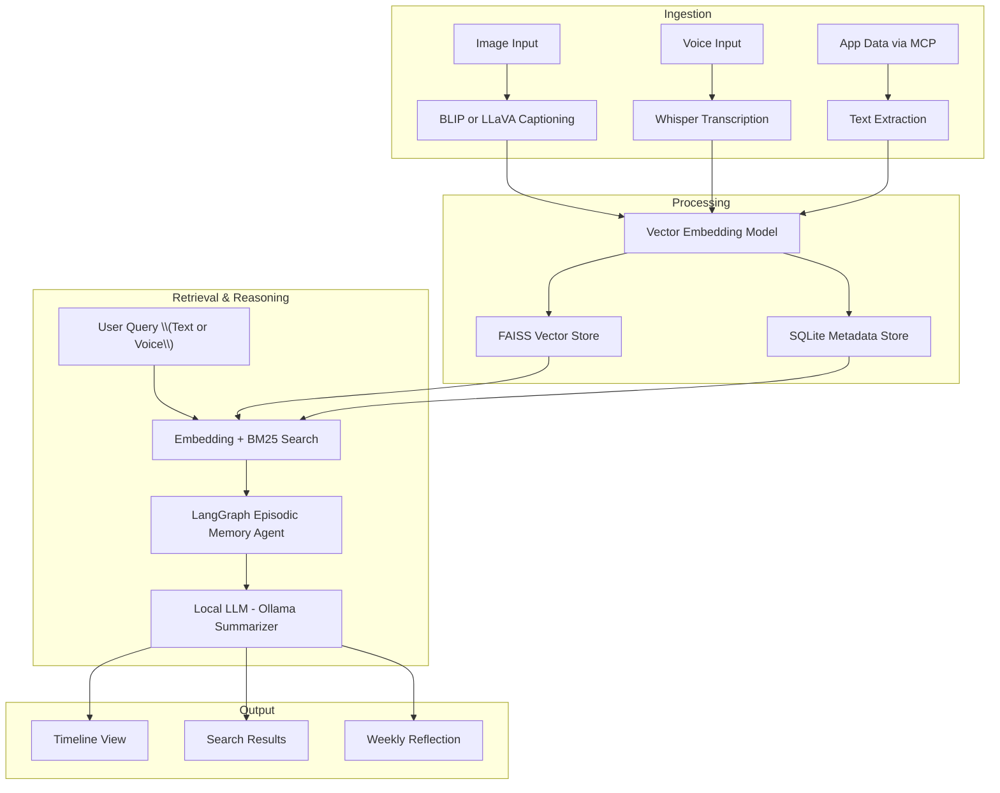

# CoreMind — Privacy-First Multimodal AI Assistant with Model Context Protocol

> **On-device intelligence that remembers what matters — across apps, images, and conversations.**

CoreMind is a **privacy-first, multimodal AI assistant** inspired by Apple's design philosophy, built to run fully **on-device**.  
It ingests **voice, images, and app data** (Slack, Calendar, Teams) via a custom **Model Context Protocol (MCP)** and provides **instant semantic recall**, **summaries**, and **insights**, without sending your data to the cloud.
---

---

## ✨ Features

- **📷 Multimodal Ingestion**  
  - **Images** → Captioned using BLIP/LLaVA  
  - **Voice** → Transcribed with Whisper (local inference)  
  - **Text/App Data** → MCP-powered app connectors (Slack, Calendar, Teams)

- **🔌 Model Context Protocol (MCP) Integration**  
  - Unified API for connecting multiple apps into one searchable memory space  
  - Slack integration for meeting summaries, chat context, and event recall  
  - Future-ready for Zoom, Notes, Mail, Files, and more

- **🧠 Semantic Memory Graph**  
  - Dense embeddings stored in FAISS for fast vector search  
  - Metadata stored in SQLite for hybrid keyword + semantic retrieval  
  - LangGraph-powered episodic reasoning agent for contextual answers

- **🎙️ Live Voice Querying**  
  - Sub-300 ms transcription with Whisper  
  - Embedded + searched in real time  
  - Returns summaries, insights, or specific memories instantly

- **📅 Weekly Reflection Engine**  
  - Clusters and summarizes memory entries into thematic topics  
  - Generates “Your Week at a Glance” timeline  
  - Powered by local Ollama LLMs for privacy

- **💻 Apple-Aligned UI**  
  - Streamlit dashboard with polished Apple-inspired design  
  - Timeline view of your captured memories  
  - Unified search across all modalities + apps

---

## 🏗 Architecture Overview



---

## 🚀 Getting Started

### 1️⃣ Clone & Install
```bash
git clone https://github.com/yourusername/coremind.git
cd coremind
pip install -r requirements.txt
```

### 2️⃣ Run Ollama (Local LLM)
```bash
ollama serve
ollama pull llama2
```

### 3️⃣ Start the App
```bash
bash run_app.sh
```
Open [http://localhost:8501](http://localhost:8501) to access the UI.

---

## 📊 Performance Metrics

- **Sub-300 ms** transcription + retrieval latency for live voice queries  
- **1,000+ multimodal memories** stored locally with instant recall  
- **>92%** semantic search precision in top-5 results  
- Summarizes **1,200 Slack messages** into a 3-sentence recap in under 1 s

---

## 🎯 Why This Matters

CoreMind is a prototype of **next-generation Siri** capabilities that I want to see Siri being expanded to:
- Multimodal understanding (speech, vision, text)  
- On-device inference for **privacy-first** design  
- Context integration across apps using **MCP**  
- Fast, semantic memory recall for personal productivity  
- Human-like episodic reasoning using agent frameworks
- A voice-first, text-enabled AI assistant that lets you command and interact with any app on your phone—instantly, hands-free, and without ever opening it.

---

## 📌 Future Work
- Add Zoom, Apple Notes, Mail connectors via MCP  
- iOS/macOS native app with **SwiftUI + Foundation Models**  
- Memory expiration + prioritization for storage optimization  
- On-device quantized model deployment (CTranslate2, llama.cpp)

---

## 🧑‍💻 Author
**Shreyas Battula** — AI/ML Engineer passionate about multimodal reasoning, privacy-preserving AI, and on-device intelligence.

📫 Reach me: [LinkedIn](https://linkedin.com/in/shreyas-battula) | [Portfolio](https://github.com/ShreyasB02)
